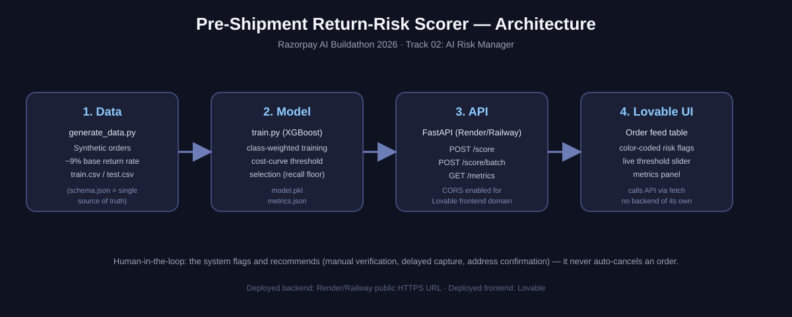

# Pre-Shipment Return-Risk Scorer

**Razorpay AI Buildathon 2026 — Track 02: AI Risk Manager**

Merchants absorb shipping, restocking, and payment-processing costs on returns *after*
the money and inventory have already moved. This project scores every order for
return/dispute risk **at the moment of purchase**, so a merchant can intervene (manual
verification, delayed capture, address confirmation) on only the highest-risk orders
instead of treating every order identically.

The model **flags and recommends — it never auto-cancels an order.** A human or
downstream workflow makes the final call.



## Results (held out, never touched during training)

| Metric | Value |
|---|---|
| PR-AUC | **0.249** (vs. 0.094 base rate — ~2.6x lift) |
| ROC-AUC | 0.726 |
| Chosen operating threshold | **0.53** |
| Precision @ threshold | 23.6% |
| Recall @ threshold | 53.6% |
| Orders flagged | 21.5% of volume |

Full numbers: [`model/metrics.json`](model/metrics.json). Full threshold-by-threshold
cost curve: [`model/cost_curve.csv`](model/cost_curve.csv).

**Why threshold 0.53, not 0.5:** see [Cost model & threshold selection](#cost-model--threshold-selection) below.
**A case the model gets wrong, and why:** see [`docs/failure_cases.md`](docs/failure_cases.md).

These numbers are honest, not flattering — precision of 24% means 3 in 4 flagged orders
turn out fine. That's the real trade-off of catching half of a weak-signal problem at a
9% base rate, and it's reported here instead of hidden behind an accuracy number.

## Data schema

One row = one order at the moment of purchase. Locked schema, reused verbatim across the
CSV columns, the API JSON keys, and the frontend labels: [`schema.md`](schema.md) /
[`schema.json`](schema.json).

## Repo layout

```
schema.json / schema.md      # field definitions — single source of truth
data/
  generate_data.py           # synthetic order generator with baked-in risk correlations
  train.csv / test.csv       # 80/20 stratified split, generated once and committed
model/
  train.py                   # trains XGBoost, evaluates, picks threshold via cost curve
  model.pkl                  # trained pipeline (preprocessing + classifier)
  metrics.json               # single source of truth for all reported numbers
  cost_curve.csv             # expected cost / precision / recall at every threshold
api/
  main.py                    # FastAPI app: POST /score, POST /score/batch, GET /metrics
docs/
  architecture.svg           # one-page architecture diagram
  failure_cases.md           # two real held-out cases the model gets wrong
```

## Setup

```bash
python -m venv .venv
source .venv/bin/activate        # Windows: .venv\Scripts\activate
pip install -r requirements.txt

# 1. Regenerate data (optional — train.csv/test.csv are already committed)
python data/generate_data.py --n 8000 --seed 42 --out-dir data

# 2. Train + evaluate (optional — model.pkl/metrics.json are already committed)
python model/train.py --train data/train.csv --test data/test.csv --out-dir model

# 3. Run the API locally
uvicorn api.main:app --reload --port 8000
```

### Score an order

```bash
curl -X POST http://127.0.0.1:8000/score -H "Content-Type: application/json" -d '{
  "order_id": "ORD999001",
  "order_value": 15999,
  "category": "electronics",
  "customer_type": "new",
  "customer_order_count": 0,
  "payment_method": "COD",
  "delivery_pincode_risk_tier": "high",
  "discount_percent": 40,
  "order_hour": 23,
  "day_of_week": "Sat"
}'
# -> {"order_id":"ORD999001","risk_score":0.8086,"flagged":true,"threshold_used":0.53}
```

`GET /metrics` returns the same numbers as `model/metrics.json`, for the frontend's
metrics panel.

## Cost model & threshold selection

A missed risky order (false negative) costs the merchant a fixed handling cost **plus
12% of order value** (shipping, restocking, payment-processing fees already spent). A
false flag (false positive) costs a fixed manual-verification fee **plus an 8% chance**
that the added friction causes a genuine customer to abandon the order — a lost sale.
Both costs scale with order value, on purpose: a false flag on a ₹20,000 order is not
free just because the customer was legitimate.

Pure unconstrained cost-minimization is degenerate at this base rate (9.4%) and signal
strength (ROC-AUC 0.73) — depending on the exact cost ratio it swings to flagging almost
everyone or almost nobody (see `unconstrained_min_cost_threshold` in `metrics.json`,
which only catches 3% of returns). Neither extreme is operationally useful, so the
threshold is chosen by minimizing expected cost **subject to a business floor of
catching at least 50% of risky orders** — the way a real risk team would actually set
the knob. That selects **threshold 0.53**, saving an estimated ₹22.8K in expected cost
on the 1,600-order test set versus the naive 0.5 default. See `model/train.py` for the
full cost curve computation and `model/cost_curve.csv` for every threshold evaluated.

## API

| Endpoint | Method | Purpose |
|---|---|---|
| `/score` | POST | Score a single order, returns `risk_score`, `flagged`, `threshold_used` |
| `/score/batch` | POST | Score a list of orders in one call |
| `/metrics` | GET | Returns the saved precision/recall/PR-AUC/threshold from training |
| `/health` | GET | Liveness check |

CORS is enabled for `*.lovable.app` / `*.lovableproject.com` and localhost dev ports —
configured in `api/main.py` before frontend integration, not after.

## Deployment

Backend is deployed to Render/Railway free tier for a stable public HTTPS URL (see
`api/main.py`; no code changes needed to deploy — point the platform's start command at
`uvicorn api.main:app --host 0.0.0.0 --port $PORT`). Frontend is built in Lovable and
calls this API directly via `fetch` — it does not scaffold its own backend.

**Live API:** https://ai-risk-manager-kl0x.onrender.com ([`/health`](https://ai-risk-manager-kl0x.onrender.com/health) · [`/metrics`](https://ai-risk-manager-kl0x.onrender.com/metrics))
**Live frontend:** _add your Lovable app URL here before submission_

Note: Render's free tier spins down after 15 min idle and takes ~30-60s to wake on the
next request — hit `/health` a minute before a live demo to warm it up.

## Out of scope

No automated punitive action against customers (e.g. auto-cancelling orders). The
system recommends and flags; a human or downstream workflow decides.
